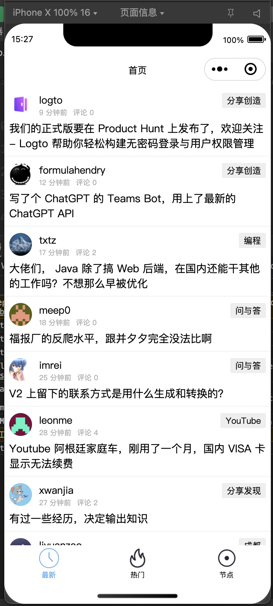
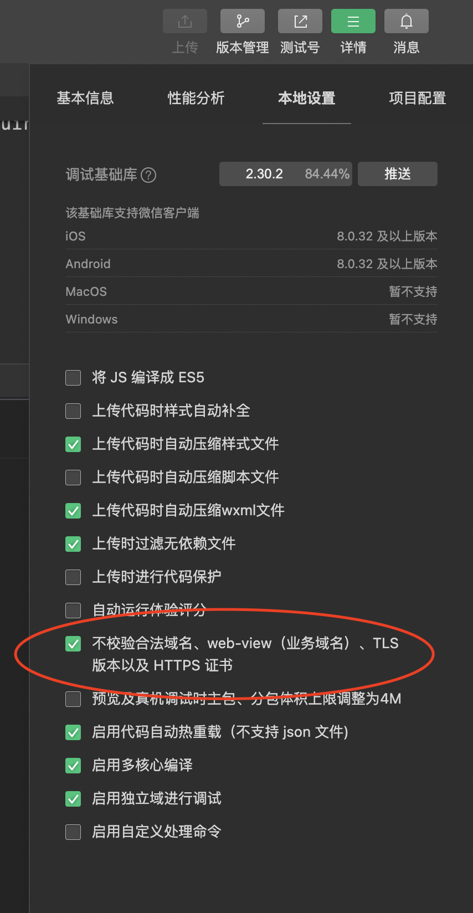

### 1. Choice:
- Vue 3
- NutUI 4
- CSS
- JS

### 2. wxapp 需要设置代理

### 3. Run in localhost
- `yarn install`
- `yarn run dev:weapp`
- Import in WX tool
- set proxy

### 3. Demo

### 4. 小程序真机调试request:fail url not in domain list？

### 5. TODO:
- Node Page and Node Detail Page refactor
- Use NutUI

### 6. Import NutUI
- https://taro-docs.jd.com/docs/nutui
- requirement: `yarn add @tarojs/plugin-html @nutui/nutui-taro`

